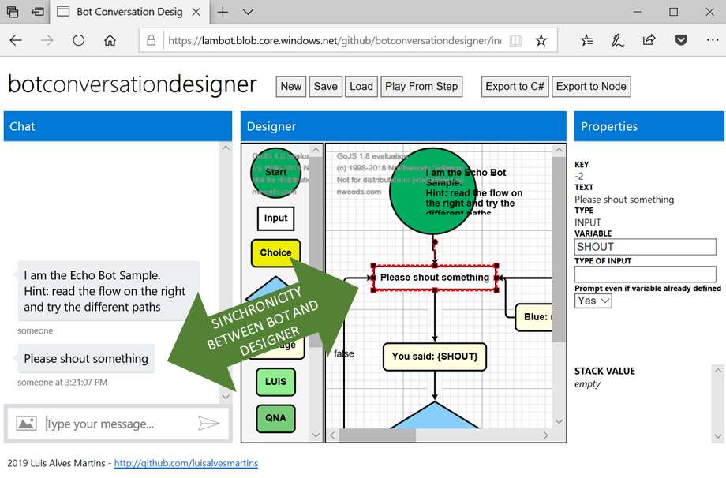
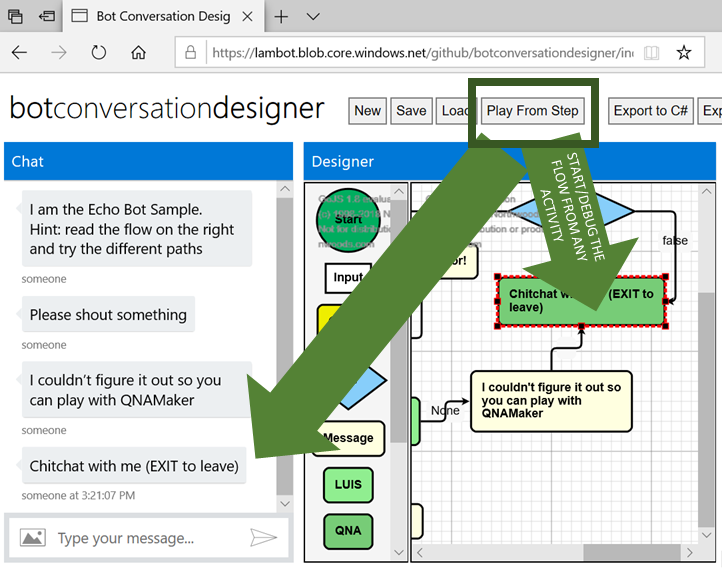
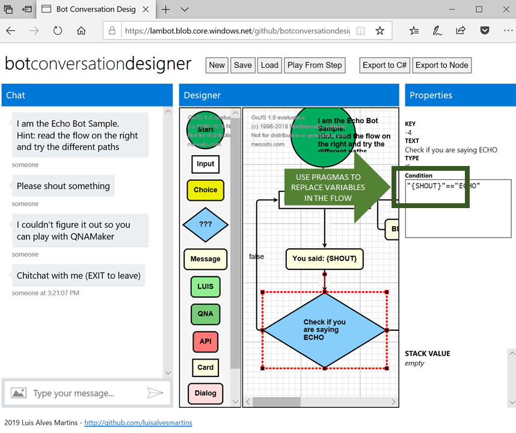
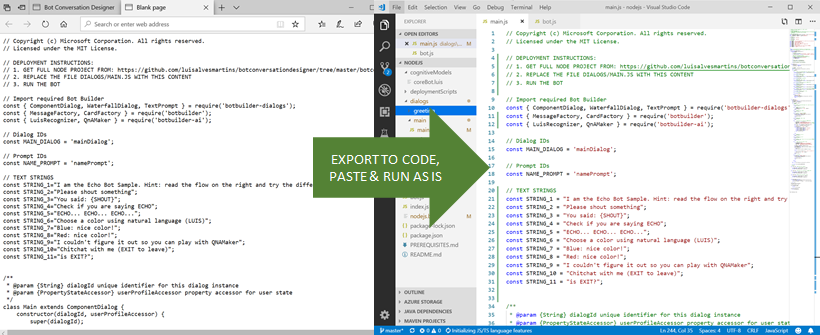

# bot conversation designer

Design and debug visually your bot conversations.

Create the Microsoft Bot Framework code (node or c#) automatically from the designer.

Play with it here: https://lambot.blob.core.windows.net/github/botconversationdesigner/index.html

## Features
- No need to deploy a bot to use the designer, run it on the browser
- Load and Save bot flows locally
- The conversation is synchronized with the visual designer 

- Add nodes on the flow by drag-n-drop of elements or by typing on the conversation window: **bot:** _your text_
- Jump to any activity and play the conversation from there

- Use pragmas {_var_} to do IF or show user input 

- Export the flow to C# or Node 

- Enable to add LUIS utterances when you are running the flow in debug mode.

if you want to try some demo flows, when you press load load the url link instead of a local file: 
https://lambot.blob.core.windows.net/github/botconversationdesigner/GreenCard.botdesign 

- File content is compatible with botengine project

## Implementation backlog:
- EXPORT TO Node missing features
    - API
    - DIALOG
- EXPORT TO C# missing features: 
    - card
    - API
    - DIALOG
- (new feature) Enable check if variable is already filled for any activity
- Enable publishing LUIS utterances with entities definition.
