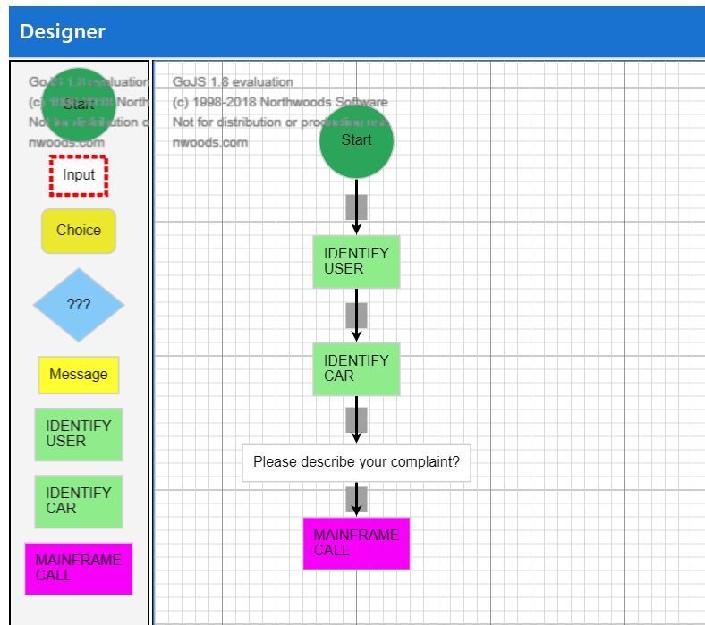

# bot conversation designer

Design and debug visually your bot conversations.

Create the Microsoft Bot Framework code (node or c#) automatically from the designer.

Play with it here: https://lambot.blob.core.windows.net/github/botconversationdesigner/index.html

Bot conversation designers can be classified in this groups:
- Draft and simulate the experience (“look how it will be”)
- Design and run the conversation (“all in one”) 
- Design the conversation and generate the code (“design and refine”)
- Design the conversation based on “intelligence” ("build itself")
- Design the conversation from a business perspective (“no IT”)

This project addresses points 3 and 5 of this list. Point 2 is addressed by using this project together with [BotEngine](https://github.com/luisalvesmartins/botengine).

## Features
- No need to deploy a bot to use the designer, run it on the browser
- Load and Save bot flows locally
- The conversation is synchronized with the visual designer 

- Add nodes on the flow by drag-n-drop of elements or by typing on the conversation window: **bot:** _your text_
- Jump to any activity and play the conversation from there

- Use pragmas {_var_} to do IF or show user input 

- Export the flow to C# or Node 

- Enable customization of the interface for business users by loading business oriented scenarios with macro functionality configured by the company IT

- Enable to add LUIS utterances when you are running the flow in debug mode.

if you want to try some demo flows, when you press load load the url link instead of a local file: 
https://lambot.blob.core.windows.net/github/botconversationdesigner/GreenCard.botdesign 

- File content is compatible with botengine project

- Builtin activities
    - Start - Initialize the flow, enable translation services
    - Input - Ask for user input
    - Choice - Presents navigation options to user
    - If - Evaluates condition, flows to true or false branches
    - Message - Displays a message
    - LUIS - Calls LUIS Service
    - QNA - Calls QNA Service, designer has multiturn capabilities
    - Search - Calls Azure Search service, displays result as carousel
    - Card - Presents a Card
    - API - Calls an API
    - Dialog - Jumps to another Dialog
    - Reset Var - Cleans specified variables
    - REST Call - Performs a REST call

## Implementation backlog:
- EXPORT TO Node missing features:
    - API
    - Translation (runs on the html but is not yet included on the export)
    - Application Insights configurations
- EXPORT TO C# missing features: (will implement only if there is demand)
    - card
    - API
    - REST CALL
    - Translation
- (new feature) Enable check if variable is already filled for any activity
- Enable publishing LUIS utterances with entities definition.
