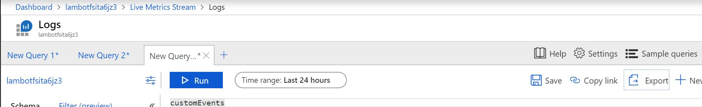
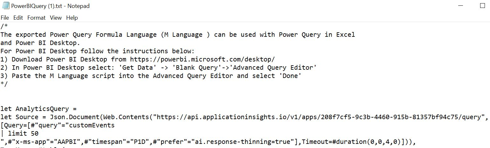
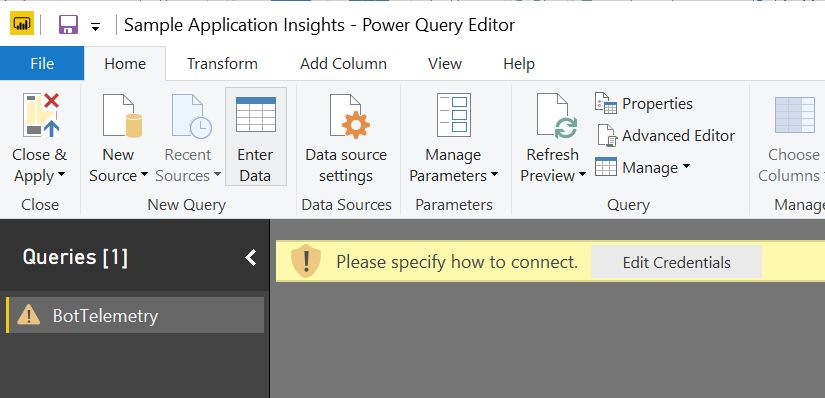
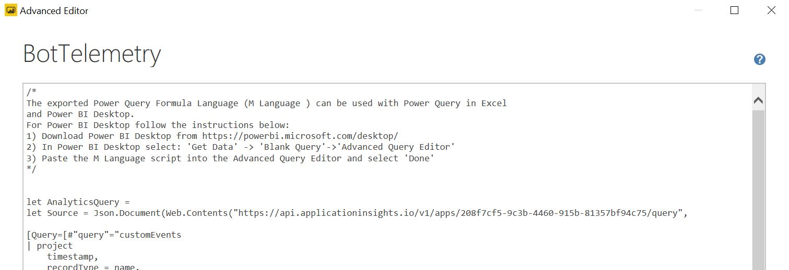
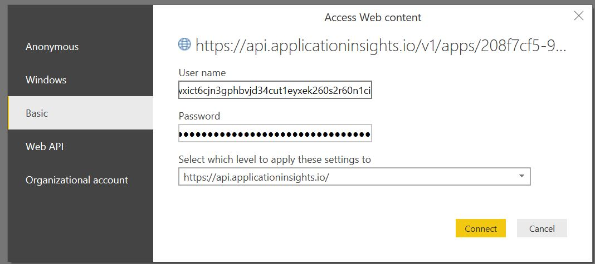

# PowerBI Application Insights Report

A PowerBI sample report is provided. You need to configure the application insights data on the sample.bot file inside the services section:

`````
    {
      "type": "appInsights",
      "apiKeys": {},
      "applicationId": "ac01e7fb-xxxx-xxxx-xxxx-155b7d12c7e4",
      "id": "2",
      "instrumentationKey": "e0d7b028-xxxx-xxxx-xxxx-1228db7095d9",
      "name": "appInsights",
      "serviceName": "insights",
    },
`````

## How to change it to your subscription

### 1. Gather the Application Insights report GUID

On the Application Insights view in the Azure Portal



Click Export and select PowerBI. On the text file copy and paste the guid:



### 2. With PowerBI Desktop open the Sample Application Insights.pbix

Select "Edit Queries"


Select "Advanced Editor"



Replace the GUID with the previous Guid



Select basic authentication and use the key both on the username and password



Now your report should be running. 

Customize it!